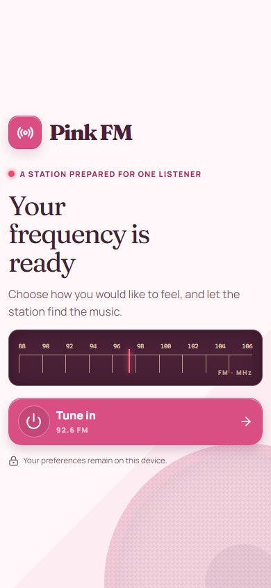
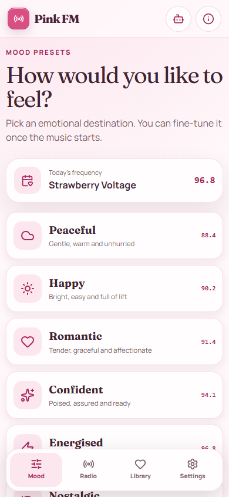
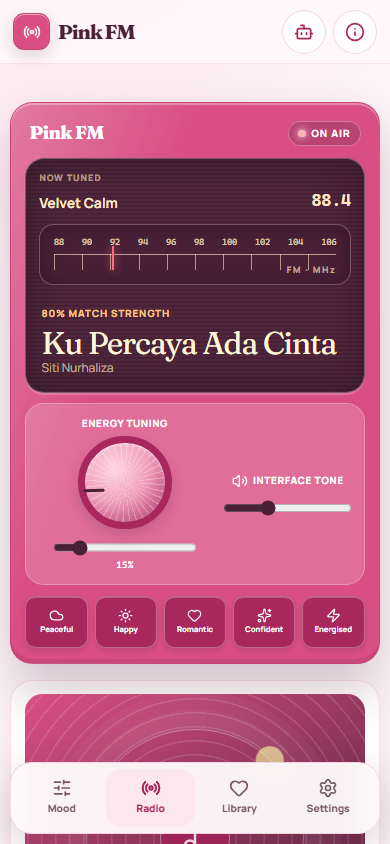
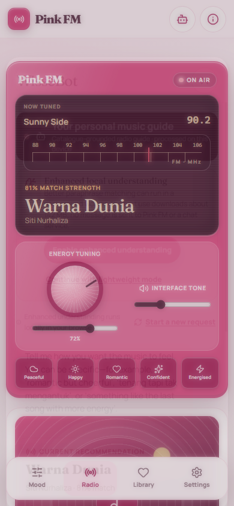
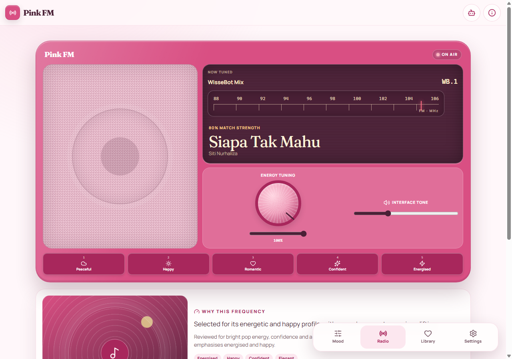
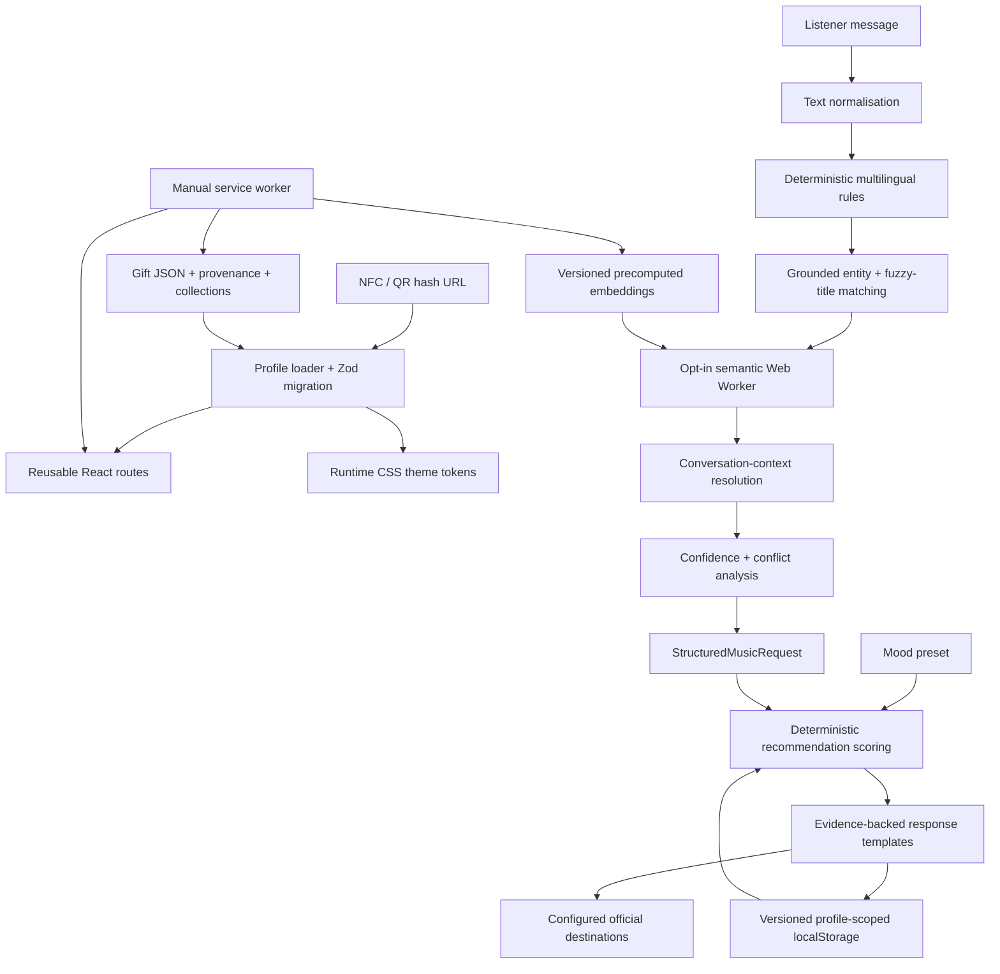

# Pink FM

Pink FM is a mobile-first, installable retro mood-radio gift. The listener chooses how they want the music to feel, receives a catalogue-grounded recommendation, and can refine the station in English, Bahasa Melayu, or conversational English-Malay with WisseBot.

The default `siti` edition is centred on Siti Nurhaliza. Pink FM stores no music or lyrics: playback always goes to a configured official streaming destination. The application remains a static, profile-driven PWA that can be hosted entirely on GitHub Pages.

> Pink FM is an independent personal project and is not affiliated with or endorsed by the featured artist or streaming services.

## Current edition

The Phase 2 Siti catalogue audit records:

| Measure | Count |
| --- | ---: |
| Unique active tracks | 142 |
| Reviewed and recommendation-ready | 105 |
| Verified metadata, awaiting full emotional review | 37 |
| Provisional | 0 |
| Albums and distinct releases represented | 38 |
| Data-driven collections | 12 |
| Catalogue eras | 6 |

The catalogue spans 1990s classics through recent releases, traditional recordings, studio material, duets, collaborations, selected festive music, and singles. It is intentionally curated rather than a claim of complete discography coverage. Run `npm run catalog:audit -- --slug siti` for the current distribution and editorial warnings.

## Screenshots

These captures are refreshed from the production preview by `npm run qa:browser`.

| Welcome | Mood presets |
| --- | --- |
|  |  |

| Radio | WisseBot |
| --- | --- |
|  |  |



## Technology

- React 19, strict TypeScript, and Vite 8
- Tailwind CSS 4 through the official Vite plugin plus a custom physical-radio design layer
- React Router hash routing
- Zod runtime validation and backward-compatible content migration
- Lucide React icons
- Fraunces Variable and Manrope Variable, self-hosted through npm
- `@huggingface/transformers` for an opt-in browser-side multilingual embedding model
- A dedicated semantic Web Worker and compact precomputed catalogue embeddings
- Vitest, jsdom, React Testing Library, and user-event
- ESLint flat configuration
- A manually controlled service worker and web app manifest

There is no server runtime, database, registration, analytics, external LLM, paid API, or browser secret.

## Local installation

Requirements: an active LTS Node.js release, npm, and Git.

```bash
git clone https://github.com/Wissebo-Abdulmajid/pink-fm.git
cd pink-fm
npm ci
npm run dev
```

Open the local URL printed by Vite and use `#/g/siti`. On Windows, if PowerShell blocks `npm.ps1`, substitute `npm.cmd` for `npm`.

## Commands

| Command | Purpose |
| --- | --- |
| `npm run dev` | Start Vite development mode |
| `npm run build` | Type-check and create `dist/` |
| `npm run preview` | Serve the production build locally |
| `npm run lint` | Run ESLint |
| `npm run typecheck` | Run strict TypeScript checks |
| `npm run test` | Run all Vitest tests once |
| `npm run content:validate` | Validate every deployed gift profile, provenance, collections, and embedding freshness |
| `npm run gift:create -- --slug <slug> --artist "<artist>" --station "<station>"` | Create a profile from `_template` |
| `npm run catalog:import -- --slug <slug> --input <file> --dry-run` | Validate and preview a prepared CSV/JSON import |
| `npm run catalog:import -- --slug <slug> --input <file> --apply` | Explicitly apply a validated import |
| `npm run catalog:audit -- --slug <slug>` | Report scale, coverage, provenance, duplicates, and editorial warnings |
| `npm run catalog:coverage -- --slug <slug>` | Print mood, era, collection, album, and curation coverage |
| `npm run catalog:dedupe -- --slug <slug>` | Detect likely duplicate recordings and provider URLs |
| `npm run bot:embeddings -- --slug <slug>` | Regenerate matching model/index/binary embeddings |
| `npm run bot:evaluation:generate` | Recreate the deterministic evaluation corpus |
| `npm run bot:evaluate` | Run the real lightweight and semantic evaluation pipelines |
| `npm run icons:generate` | Recreate original Pink FM PNG icons |
| `npm run qa:browser` | Exercise the production preview and refresh screenshots |
| `npm run verify` | Run lint, types, content validation, catalogue audit, tests, and production build |

The Apple catalogue-source preparation commands are maintenance tools, not runtime dependencies. They consume a saved provider response and a curator-reviewed selection; the production app never scrapes a streaming service.

## Architecture



The important boundaries are explicit:

1. Rule-based parsing owns negation, comparisons, corrections, and precise commands.
2. Semantic interpretation recognises paraphrases and retrieves similar prototypes/tracks; it cannot reverse exact rules.
3. Catalogue retrieval returns IDs that exist in the active profile.
4. Recommendation scoring ranks only validated candidates.
5. Response rendering uses structured evidence and verified profile metadata, not unrestricted generation.

## Gift-profile format

Every profile lives in `public/gifts/<slug>/`:

```text
gift.json                 station, artist policy, recipient, assistant, creator, theme, features
moods.json                named target vectors and station frequencies
tracks.json               catalogue metadata, editorial vectors, contexts, curation state
collections.json          data-driven collections and weak ranking weights
messages.json             editable interface and assistant copy
catalog-sources.json      source registry and per-track verification audit
embeddings/manifest.json  model, revision, dimensions, content hash, and binary metadata
embeddings/index.json     grounded track/prototype offsets
embeddings/*.bin          normalised float32 catalogue and prototype vectors
assets/                   profile-owned permitted media
```

Schemas in `src/config/schemas.ts` are shared by browser loading, CLI validation, imports, audits, and tests. Version-one track records migrate safely to the extended version-two shape. Invalid content shows a controlled configuration screen rather than rendering partial data.

## Curation levels and provenance

Every track has one explicit status:

- `reviewed`: identity, destination, release information, and subjective recommendation profile have been reviewed; no ranking penalty.
- `verified-metadata`: identity and official destination are verified, but emotional curation still needs a full pass; modest ranking penalty.
- `provisional`: credible but incomplete; visible as provisional and strongly penalised in mood ranking.

`curationConfidence` is an editorial confidence value, not scientific certainty. Mood annotations, semantic descriptions, emotional arcs, vocal/instrumental character, use cases, and `avoidWhen` guidance are subjective recommendation metadata.

The Siti edition records every track's `sourceIds` and verification date in `catalog-sources.json`. Its provider snapshot is retained under `catalog/import/` so catalogue preparation is reproducible without live scraping. The main references audited on 13 July 2026 were the official [Apple Music artist page](https://music.apple.com/my/artist/siti-nurhaliza/102288156), [Spotify artist page](https://open.spotify.com/artist/5d0bxRte3J74ZXyEGRL8uU), and [Spotify editorial artist playlist](https://open.spotify.com/playlist/37i9dQZF1DWSW97Ajf5E1t), plus individual provider release pages registered in the source file.

Provider digital release dates can differ from original physical release dates. Keep `null` when a value is uncertain and never infer an album, date, credit, or official URL from a search snippet.

## Importing and maintaining tracks

Prepare CSV or JSON records deliberately; do not make a live scraper part of the build.

```bash
npm run catalog:import -- --slug siti --input catalog/import/new-records.json --dry-run
npm run catalog:import -- --slug siti --input catalog/import/new-records.json --apply
npm run catalog:dedupe -- --slug siti
npm run catalog:audit -- --slug siti --json docs/catalog-audit.json
npm run catalog:coverage -- --slug siti
npm run bot:embeddings -- --slug siti
npm run content:validate
```

The importer normalises only for comparison, preserves display punctuation and accents, detects likely duplicate titles and provider URLs, refuses malformed records, and does not overwrite reviewed emotional metadata without an explicit decision. `--dry-run` is the default-safe workflow; applying changes requires `--apply`.

The audit fails on structural errors and reports editorial matters as warnings: partial album representation, weak mood areas, suspicious identical vectors, missing provenance, tracks unlikely to rank, duplicate primary recordings, malformed URLs, and missing destinations. Remote `HEAD` checks are optional via `--check-links` because provider anti-bot responses and transient networks should not make ordinary CI nondeterministic.

After any semantic description, track ID, collection, or model change, regenerate embeddings. `content:validate` recomputes the catalogue hash and fails stale manifests with the exact `npm run bot:embeddings` instruction.

## Recommendation engine

The recommender is deterministic, content-based, and explainable. Source weights currently allocate:

- 45% mood-vector similarity
- 10% semantic catalogue retrieval when available
- 6% activity/context suitability
- 5% desired energy and 4% desired intensity
- 8% learned listener preference
- 6% novelty
- 5% positive-feedback/favourite affinity
- 3% time suitability and 3% artist policy
- 2.5% era and 2.5% collection affinity
- 1% version preference

Recent-track, same-album, secondary-artist, and curation-confidence penalties are applied separately. A provisional candidate cannot casually outrank a closely matching reviewed track. Primary-artist policy is data-driven and defaults to `primary-only` for the Siti profile.

Diversity reranking prevents a recommendation queue from collapsing into one album when similarly suitable alternatives exist. Session requests support another choice, something different, another era, more energy, less intensity, a deeper cut, a familiar favourite, a duet, something traditional, or something modern.

Explanations are derived from actual score contributions and structured request evidence. Technical details are tucked behind “Why this recommendation?” rather than dominating the radio display.

## WisseBot hybrid understanding

WisseBot combines deterministic language handling with opt-in semantic embeddings:

- English, Bahasa Melayu, conversational Malay, and common English-Malay code-switching
- exact multilingual synonym resources kept in editable data modules
- negation such as “not sleepy,” “jangan sedih,” and “tak terlalu slow”
- comparative refinements and active-target preservation
- activity and time context
- familiar/discovery, traditional/modern, era, collection, duet, and artist constraints
- fuzzy title, album, artist, collection, and mood entity matching with guarded thresholds
- focused clarification for moderate matches or ambiguous concepts
- bounded profile-scoped conversation context and a visible new-request action

Every interpretation becomes a `StructuredMusicRequest` with confidence and evidence sources (`exact-rule`, `entity-match`, `semantic-similarity`, `previous-context`, `user-preference`, or `default-assumption`). Free-form user text is never sent directly to the recommender.

Response copy is assembled from the structured interpretation, selected track metadata, score contributions, and configured patterns. Unsupported requests about lyrics, private life, speculative facts, diagnosis, or capabilities are redirected without a generated factual answer.

### Local semantic model

The chosen model is `Xenova/multilingual-e5-small`, revision `761b726dd34fb83930e26aab4e9ac3899aa1fa78`, with quantised `q8` weights, mean pooling, L2 normalisation, and 384-dimensional embeddings. It was selected for multilingual coverage, compact retrieval-oriented representations, Transformers.js compatibility, and materially smaller browser cost than a text-generation model.

The model is not in the initial application bundle. Opening WisseBot does not download it silently: Pink FM discloses an estimated 142 MB first-use download and requires opt-in. Inference runs in a dedicated worker, prefers WebGPU where supported, falls back to WASM, times out safely, and can be disabled at any time. Model resources use the browser/Hugging Face cache where available; the service worker does not intercept third-party model files.

Build-time measurements on the development machine were 12,994 ms for the first downloaded CPU model load, 2,945 ms for 142 track embeddings, and 211 ms for 93 prototypes. The final cached Node CPU evaluation loaded in 1,213 ms; its first and repeat test queries measured 21 ms and 25 ms. In a fresh headless Chrome profile with WebGPU unavailable, the automatic WASM path initialized in 14,455 ms and measured 81 ms then 32 ms for two browser requests. These are environment-specific diagnostics, not mobile promises. See `public/gifts/siti/embeddings/benchmark.json`, `docs/bot-evaluation.json`, `docs/browser-qa-semantic.json`, and `docs/semantic-model-benchmark.md` for the recorded conditions.

### Lightweight fallback

The listener can choose “Continue with lightweight mode,” set it permanently in Settings, or disable `features.semanticUnderstanding` in profile JSON. Deterministic multilingual parsing, catalogue entity matching, recommendations, favourites, history, and every radio screen continue to work. A failed worker/model/index reports its state and falls back without making the main radio unusable.

## Bot evaluation

The checked-in corpus contains 335 English, 285 Malay, 185 mixed-language, 100 typo/noisy, 50 unsupported/adversarial cases, and 100 multi-turn sequences containing 300 turns. It covers mood combinations, negation, comparisons, activities, time, era, traditional/modern, discovery, title typos, corrections, rejections, nonsense, lyric requests, and attempts to elicit invented facts.

```bash
npm run bot:evaluation:generate
npm run bot:evaluate
```

The evaluator runs the real providers and recommendation engine. It reports intent/kind accuracy, multi-label mood precision/recall/F1, negation, entities, clarification, unsupported requests, context follow-ups, grounding, and measured inference time. Two hard metrics must remain zero: hallucinated catalogue IDs and unsupported factual claims emitted by response templates. Evaluation results are evidence, not a claim that all natural language is solved; ambiguous colloquial phrasing remains an ongoing editorial area.

## Adding another artist edition

```bash
npm run gift:create -- --slug adele --artist "Adele" --station "Velvet FM"
```

The command validates the slug, copies `_template`, updates profile identity, and prints `#/g/adele`. It refuses an existing directory unless `--force` is explicit.

Then:

1. Edit `gift.json`, including artist policy and semantic settings.
2. Replace the fictional template demo record with verified catalogue entries.
3. Register every source and per-track verification in `catalog-sources.json`.
4. Curate subjective mood/semantic metadata and collections.
5. Add only permitted images under `assets/`.
6. Add verified official HTTPS destinations.
7. Generate profile embeddings.
8. Run the validator, catalogue audit, tests, and production build.

No React component, recommendation function, or route needs modification. Multiple editions coexist at `#/g/siti`, `#/g/adele`, and `#/g/maher-zain`.

## Optional secondary artists

`gift.json` supports `primary-only`, `primary-preferred`, and `multi-artist` policies. The Siti profile defines a disabled `malaysian-legends` collection and keeps `allowSecondaryCollection: false`; no secondary catalogue is populated in this phase.

To enable one later, add independently verified secondary-artist tracks and provenance, add their artist IDs to a data-driven collection, change the policy deliberately, regenerate embeddings, and rerun all audits. The UI reads the selected track's configured artist, and primary-preferred mode applies a penalty so a secondary artist does not silently replace a suitable primary-artist result.

## Copyright and music-link policy

Do not commit music, lyrics, karaoke files, fan uploads, scraped media, unlicensed cover art, or private messages. Verify title and credit metadata against official artist, label, or licensed streaming pages. An external URL is labelled official only when its registered provenance supports that description.

The MIT licence applies to application code only. It does not grant rights to artist names, music, artwork, streaming trademarks, or user-supplied profile media.

## PWA and offline behaviour

The manifest uses original Pink FM icons and a relative scope/start URL. The service worker registers only in production:

- profile JSON and same-origin embedding metadata/binaries: network first with cached fallback;
- same-origin scripts, styles, icons, and profile assets: stale while revalidate;
- navigation: network first with cached shell/offline fallback;
- third-party players, music, and model hosting: never intercepted.

An update banner appears when a worker waits. After one successful online load, the interface can reopen cached catalogue metadata, local preferences, library history, and deterministic recommendations offline. External playback and a first-time semantic-model download may require connectivity.

## GitHub Pages deployment

The app works before a custom domain is approved.

### Phase A: fallback address

1. Create a public repository named `pink-fm` under `Wissebo-Abdulmajid`.
2. Add the remote, commit, and push `main`:

   ```bash
   git branch -M main
   git remote add origin https://github.com/Wissebo-Abdulmajid/pink-fm.git
   git add .
   git commit -m "Build Pink FM Phase 2"
   git push -u origin main
   ```

3. In **Settings → Pages**, choose **GitHub Actions** as the source.
4. The workflow runs `npm ci`, derives `/<repository-name>/` unless repository variable `VITE_BASE_PATH` exists, runs `npm run verify`, uploads `dist`, and deploys with minimum permissions.
5. Test `https://Wissebo-Abdulmajid.github.io/pink-fm/#/g/siti`.

Hash routing preserves direct NFC routes without server rewrites. Substitute the real owner/repository if those names change.

## Free `.is-a.dev` alias

`.is-a.dev` is a better fit than `.js.org` for this personal developer-built project. Preferred candidate: `pinkfm.is-a.dev`; alternatives are `wissebot.is-a.dev`, `pink-radio.is-a.dev`, and `tune-with-wisse.is-a.dev`, subject to availability.

The workflow below was rechecked on 13 July 2026 against the official [registration repository](https://github.com/is-a-dev/register), [domain structure](https://docs.is-a.dev/domain-structure/), and [GitHub Pages guide](https://docs.is-a.dev/guides/github-pages/). Recheck them before submitting; maintainers explicitly review pull requests and may change rules.

1. Deploy and verify the GitHub Pages fallback.
2. Fork `is-a-dev/register` yourself.
3. Create `domains/pinkfm.json` using the current required owner fields and `"CNAME": "Wissebo-Abdulmajid.github.io"`.
4. Submit the pull request manually and respond to reviewers. Do not submit an unauthorised automated or low-quality generated PR.
5. Wait for merge and DNS publication.
6. Only then add `pinkfm.is-a.dev` under repository **Settings → Pages → Custom domain**.
7. If GitHub requires domain verification, follow the current guide for its separate hostname TXT file and PR.
8. Set repository variable `VITE_BASE_PATH=/` and trigger a new deployment.
9. Enable **Enforce HTTPS** when the certificate is ready.
10. Test both the custom domain and fallback route.

A free community subdomain is controlled by its operators and cannot be guaranteed forever. Preserve the GitHub Pages URL as the fallback.

## NFC and QR handoff

The NFC tag stores only the final URL; it does not store Pink FM.

Preferred after approval:

```text
https://pinkfm.is-a.dev/#/g/siti
```

Fallback:

```text
https://Wissebo-Abdulmajid.github.io/pink-fm/#/g/siti
```

1. Complete deployment and select the final stable URL.
2. Open the exact URL on multiple iOS and Android phones and confirm the `siti` profile.
3. Write one NDEF URI record containing only that URL to an NTAG215 card.
4. Print a QR code containing the same URL.
5. Test NFC through the finished card material and common phone cases.
6. Keep the tag writable during testing and domain approval.
7. Lock it only after the exact domain and hash route are proven stable.

Card copy:

```text
Front
PINK FM
TAP TO TUNE IN

Back
Choose how you want to feel.
Let your frequency find the music.

NFC + QR ACCESS
```

Do not place credentials or private data in the URL. An unusual slug provides obscurity, not authentication: public static files and a public repository can be inspected.

## Privacy limitations

Favourites, feedback, settings, affinities, history, and conversation preferences use a versioned `localStorage` layer scoped by gift slug. Version-one and version-two state migrate to version three; malformed data resets safely. Browser storage is not encrypted and clearing site data removes it.

The opt-in semantic message is processed locally in the worker; it is not sent to Pink FM or an LLM service. The browser may contact Hugging Face/CDN origins to obtain public model files on first use. Other people with access to the same browser profile may inspect local storage.

Static hosting is public. `recipient.showName` affects display, not access. Never commit confidential recipient copy.

## Accessibility

Pink FM uses landmarks, ordered headings, native controls, visible focus, minimum 44-pixel targets, keyboard-operable tuning controls, screen-reader recommendation announcements, and a focus-trapped dialog with Escape restoration. Recommendation/curation states use text as well as colour. Reduced motion follows both the operating-system preference and local setting. There is no autoplay.

Primary flows should be retested with keyboard only, 200% zoom, screen-reader navigation, reduced motion, high contrast, 320-pixel width, and long translated/title content whenever UI structure changes.

## Testing

`npm run verify` is the deterministic release gate. It covers schemas and migration, controlled profile errors, scale/coverage invariants, ranking and diversity, curation/artist penalties, grounding, multilingual parsing, negation, contextual follow-ups, fuzzy entities, semantic failure, embedding corruption/staleness, local-storage migration, accessibility-focused component flows, feedback, catalogue search, and honest playback states.

`npm run bot:evaluate` is a separate, heavier semantic quality run because first use may need the public 142 MB model download. The checked-in report records the exact revision and environment. Browser QA then verifies feature splitting, opt-in disclosure, lightweight fallback, responsive layouts, keyboard flows, service-worker behaviour, and console errors.

## Troubleshooting

- **Profile configuration error:** run `npm run content:validate`; both UI and CLI report exact paths.
- **Stale embeddings:** run `npm run bot:embeddings -- --slug <slug>`, then validate again.
- **Catalogue audit errors:** fix duplicate IDs/URLs, missing provenance, unsafe links, or inconsistent collections before editing warnings.
- **Enhanced understanding unavailable:** choose lightweight mode; the radio and rules remain functional.
- **Large model is downloading:** WisseBot shows progress; cancel by returning to lightweight mode. First-use cost is not part of the initial app bundle.
- **Wrong Pages styling or assets:** verify the workflow-derived base and remove an incorrect `VITE_BASE_PATH` for repository-path hosting.
- **Old content after deploy:** reload online once. Profile JSON is network-first and the update banner handles a waiting shell.
- **No playback destination:** add at least one verified HTTPS service URL; Pink FM does not render pretend controls.
- **Service-worker confusion in development:** registration is production-only. Unregister an older worker if a production build previously used the same origin.
- **PowerShell blocks npm:** use `npm.cmd` or adjust your trusted local policy yourself.

## Known limitations

- Emotional annotations are editorial and subjective; the 37 `verified-metadata` tracks still need a full human-quality listening review.
- A structural URL check cannot guarantee future availability, regional access, account requirements, or provider behaviour.
- Precomputed embeddings understand catalogue descriptions; they do not verify historical facts or translate lyrics.
- Static hosting provides no authentication, cross-device sync, or secure private messaging.
- External music playback requires the provider and may require internet access.

## Creator and licence

Designed and engineered by **WISSEBO ABDULMAJID**.

Source code is available under the MIT licence. Artist names, music, streaming marks, artwork, trademarks, and profile-owner media remain with their respective owners and are not relicensed by this repository.
