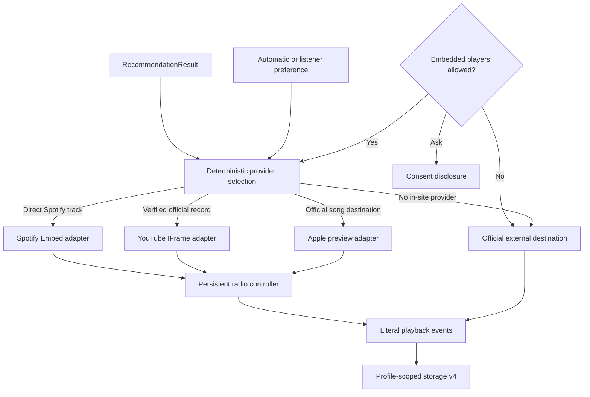

# Phase 4 playback architecture

## Boundary

Pink FM remains a static PWA. It hosts no recordings, proxies no audio, performs no provider search, carries no client secret, and has no paid backend. In-site playback is delegated only to visible official provider surfaces after explicit profile-scoped consent.

## Provider capabilities

| Provider | In site | Custom play/pause | Load next track | State/progress | Full track expected |
| --- | --- | --- | --- | --- | --- |
| Spotify Embed | yes | yes, through official controller | yes | where the API reports it | no universal claim |
| Verified YouTube | yes | yes, through IFrame API | yes | yes | yes for the verified video, subject to provider availability |
| Apple Music preview | preview | no; native iframe controls only | yes | no playback-state claim | no |
| External | no | no | no | external-open event only | no claim |

The adapters expose only these real capabilities. The UI does not render custom Play/Pause controls for Apple or external destinations.

## Lifecycle

Spotify and YouTube loaders share one promise for concurrent requests, inject one script per page session, reset after load failure, and run only after consent. One adapter/controller remains mounted while recommendations change. A provider change destroys the old controller and removes its iframe. Rapid changes retain only the latest requested entity. Recommendations never autoplay; initial playback requires a listener gesture.

Apple preview URLs are derived from validated `music.apple.com` song destinations by changing only the exact hostname to `embed.music.apple.com`. YouTube requires a validated video ID, literal official-verification flag, and catalogue source ID. Spotify accepts only exact HTTPS `open.spotify.com` track paths and derives the URI at runtime.

## Events and learning

Recommendation rotation history remains available to prevent repetition, but it is not play history. `playback-started` alone increments actual play counts and adds listening history. Iframe readiness, external opening, skip and failure never increment those values. Completion is intentionally absent unless an adapter supplies a reliable event.

## Privacy, service worker and failure

Consent is stored under the gift profile’s listener key and can be changed in Settings. External-only mode leaves recommendation, queue, feedback, favourites and WisseBot operational. Provider scripts, iframe pages, media, authentication and cookies are cross-origin and are never intercepted or cached by Pink FM’s `pink-fm-v4` service worker. Every provider surface retains a secondary official destination, retry when meaningful, and the honest offline message “Music playback requires an internet connection.”
